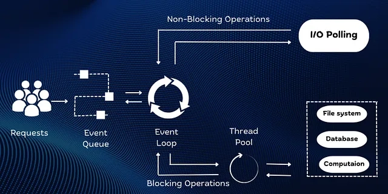
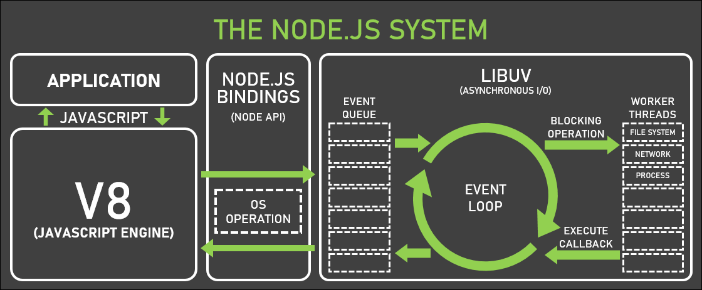

# ⚡ Node.js Notes

## 🧠 What is Node.js?

Node.js is a **JavaScript runtime environment** built on the **V8 engine**.

👉 It allows JavaScript to run **outside the browser** (on servers)

> ⚠️ Note: Node.js does NOT directly convert JS to machine code — V8 handles compilation internally.

---

## 🧩 How Node.js Works


 
Node.js is **event-driven** and **non-blocking**, making it ideal for real-time applications.

---

## Common Node.js Use Cases
- Real-time chats  
- Streaming applications  
- Microservices architecture  
- Complex SPAs (Single-Page Applications)  
- Internet of Things (IoT) projects

---

## 📥 Body, Params, Query

* **Body** → request payload
* **Params** → `/user/:id`
* **Query** → `?id=5`

---

## 🌐 HTTP Methods

| Method | Description    |
| ------ | -------------- |
| GET    | Fetch          |
| POST   | Create         |
| PUT    | Update         |
| DELETE | Remove         |
| PATCH  | Partial update |
| OPTIONS | Check supported operations |

---

## 🔁 NPM (Node Package Manager)
- Manages Node.js versions and dependencies.  
* Install: `npm install`
* Update: `npm update`
* Remove: `npm uninstall`

---


## 📦 Modules

Modules are **reusable code units** that help organize and maintain Node.js applications.

👉 Import using:
- `require()` (CommonJS)
- `import` (ES Modules)

---

### 🔹 Types of Modules

#### 1. Built-in Modules
- Provided by Node.js (no install needed)
- Examples:
  - `http` → server creation  
  - `fs` → file system  
  - `url` → URL handling  
  - `stream` → data streaming  
  - `cluster` → scaling  

---

#### 2. Custom Modules
- User-defined reusable code

```js
// customModule.js
module.exports = (a, b) => a + b;
```

---

## 🔁 Event-Driven Programming

Node.js runs code based on **events** instead of sequential flow.

👉 Listens → triggers → executes

---

## ⚡ EventEmitter

Used to **emit and listen to events**

- `on()` → listen  
- `emit()` → trigger  

```js
const emitter = new (require('events'))();

emitter.on('greet', () => console.log('Hello'));
emitter.emit('greet');
```

---


## ⚡ REPL

REPL = **Read, Evaluate, Print, Loop**

👉 Interactive Node.js shell to run code instantly

### One-line Summary  
👉 **REPL = quick testing & debugging tool**

---


## 📂 Streams
Streams allow reading/writing large data efficiently without loading all

### Types

1. **Readable** – Read operations  
2. **Writable** – Write operations  
3. **Duplex** – Read & Write both  
4. **Transform** – Modify data during transmission

```js
readStream.pipe(writeStream);
```

👉 **One-line:** Process data in chunks

---

## 📦 Buffers

Temporary memory for binary data

```js
Buffer.from("Hello");
```

---

## ⚡ Streams vs Buffer

* Buffer → full load
* Stream → chunk processing

👉 Streams are memory efficient

---


## 🧩 Cluster vs 🧵 Worker Threads vs 🔄 fork()

👉 **Cluster** → Handle more users  
👉 **Worker Threads** → Handle heavy tasks  
👉 **fork()** → Handle separate background jobs  

## 📌 Real-Life Examples

### 🧩 Cluster (Scaling)
👉 Example: E-commerce website  
- 10,000 users hitting API  
- Use cluster to utilize all CPU cores  

---

### 🧵 Worker Threads (Heavy Task)
👉 Example: Image processing / data calculation  
- Avoid blocking main thread  
- Run task in parallel  

---

### 🔄 fork() (Background Jobs)
👉 Example: Sending emails / cron jobs  
- Run separate JS file  
- Doesn’t block main app  

---


## 🔄 Transactions
A **transaction** is a group of database operations (INSERT, UPDATE, DELETE) treated as one unit.

Either all succeed ✅ or none happen ❌.

---

## ⚠️ Error Handling

👉 Handle errors using:

- **Try-Catch** → for local/synchronous errors  
- **Global Handler** → for centralized error handling  

```js
// Global Error Handler
app.use((err, req, res, next) => {
  res.status(500).json({ message: err.message });
});
```
---

## 18️⃣ Environment Variables
Store sensitive configuration securely.

```bash
PORT=5000
DB_URL=mongodb://localhost:27017
```
```js
require('dotenv').config();
console.log(process.env.PORT);
```

---

# ⚙️ Express.js & Ecosystem (Quick Notes)

---

## ⚙️ Express.js

👉 Minimal framework to build APIs

```js
const express = require('express');
const app = express();

app.use(express.json());
app.get('/', (req, res) => res.send("Hello"));
app.listen(3000);
```

---

## 🔁 Middleware

👉 Runs between request → response

```js
app.use((req, res, next) => next());
```

---

## 🔐 Authentication (JWT)

👉 Secure + stateless authentication

```js
const token = jwt.sign({ id: user.id }, "secret");
```

---

## 🔐 Security

👉 Protect your app

* CORS → cross-origin access
* Helmet → secure headers
* Input validation → prevent bad data

---

## ⚡ Rate Limiting

👉 Prevent API abuse

```js
const rateLimit = require("express-rate-limit");
```

---

## 🧠 Caching

👉 Improve performance

* Redis
* In-memory cache

---

## 🧪 Testing

👉 Ensure reliability

* Jest
* Mocha
* Supertest

---

## 🌐 Environment Variables

👉 Store config securely

```bash
PORT=5000
```

```js
process.env.PORT
```

---

## 🔥 API Best Practices

👉 Build clean & scalable APIs

* Use proper status codes
* Validate inputs
* Version APIs (`/v1`)
* Centralized error handling

---

## 🏗️ Scaling

👉 Handle high traffic

* Cluster
* Load balancing
* Microservices

---

## 🔥 Microservices

👉 Break application into small independent services
