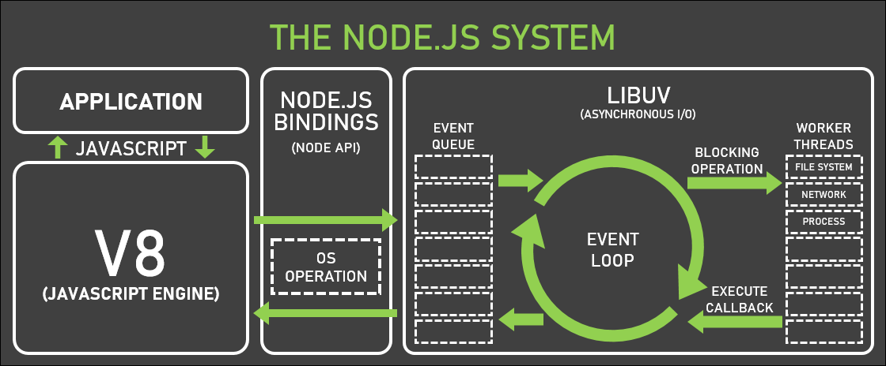
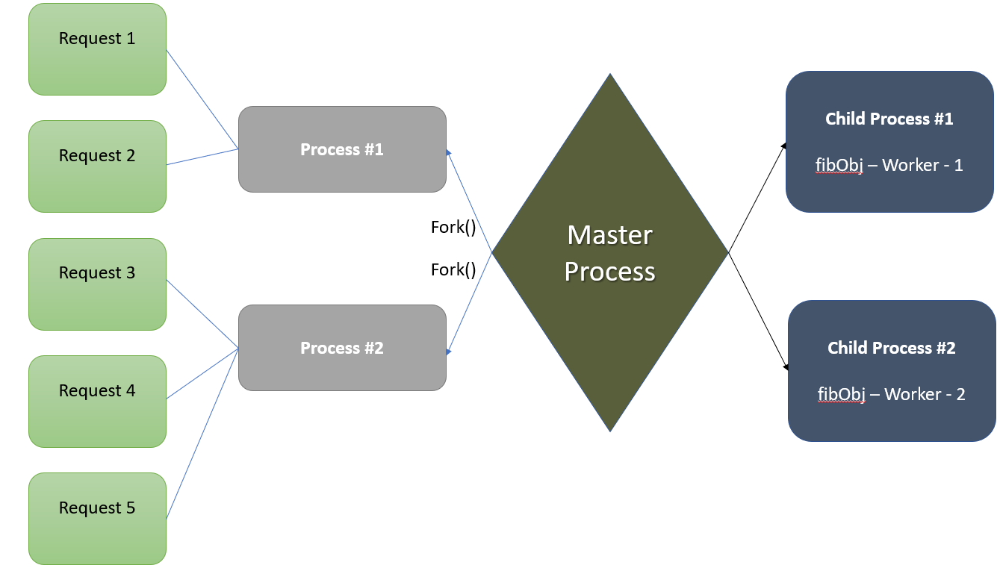

# ⚡ Node.js Notes

node.s is a **JavaScript runtime environment** 
* runtime environment allows the source code to interact with the operating system.
* it converts js code into machine code

---

## 🧩 How Node.js Works


 
Node.js is **event-driven** and **non-blocking**, making it ideal for real-time applications.

---

## 1️⃣. Body Parser, Params & Query

### 🔹 Body Parser
- Represents the **HTTP request body** (payload).  
- Example: JSON data sent from client to server.

### 🔹 Params
- URL parameters used to send additional information.  
- Example: `http://www.google.com/books/1` → `req.params.id = 1`

### 🔹 Query
- Used to retrieve data from the URL.  
- Example: `http://www.google.com/books/?id=5` → `req.query.id = 5`


---

## 2️⃣. Common Use Cases
- Real-time chats  
- Streaming applications  
- Microservices architecture  
- Complex SPAs (Single-Page Applications)  
- Internet of Things (IoT) projects

---

## 3️⃣. NPM (Node Package Manager)
- Manages Node.js versions and dependencies.  
- Commands: `npm install`, `npm update`, `npm uninstall`

---

## 4️⃣. Modules
Modules are reusable JS libraries included via `require()` or `import`.  

### 🔹 Built-in Modules
- `http`, `fs`, `url`, `querystring`, `stream`, `cluster`

### 🔹 Custom Modules
```js
// customModule.js
module.exports = function add(a, b) { return a + b; };
```

---

## 5️⃣ Why Node.js Over Java or PHP?
1. Extremely fast (V8 Engine)  
2. Huge npm ecosystem (50,000+ packages)  
3. Ideal for real-time, data-intensive applications  
4. Same language for client & server (JavaScript)  
5. Non-blocking I/O and asynchronous execution

---

## 6️⃣ Event-Driven Programming
Node.js executes code based on **events** (click, data received, etc.), instead of a traditional sequential flow.

---

## 7️⃣ EventEmitter
EventEmitter allows objects to **emit and listen for events**.

```js
const EventEmitter = require('events');
const emitter = new EventEmitter();

emitter.on('greet', () => console.log('Hello Node.js'));
emitter.emit('greet');
```

---

## 8️⃣ package.json
Contains project metadata and dependency information.  
Automatically created using:
```bash
npm init
```

---

## 9️⃣ HTTP Methods
| Method | Description |
|--------|--------------|
| GET | Retrieve data |
| POST | Create data |
| PUT | Update data |
| DELETE | Delete data |
| PATCH | Partial update |
| OPTIONS | Check supported operations |

---

## 🔟 REPL
**R**ead, **E**valuate, **P**rint, **L**oop – an interactive console to run Node.js code line by line.

---

## 11️⃣ Streams and Pipes

### 🔹 Streams
Streams allow reading/writing large data efficiently without loading all of it into memory.

**Types:**
1. **Readable** – Read operations  
2. **Writable** – Write operations  
3. **Duplex** – Read & Write both  
4. **Transform** – Modify data during transmission

### 🔹 Pipe Example
```js
const fs = require('fs');
const read = fs.createReadStream('input.txt');
const write = fs.createWriteStream('output.txt');
read.pipe(write);
```
---

## 12️⃣ Buffers
Buffers are Temporary memory storage for stream data.

```js
const buf = Buffer.from('Hello');
console.log(buf.toString()); // Hello
```
---

#### Properties
1. alloc() => ```var buf = Buffer.alloc(15)```
2. form() => ```var buf = Buffer.from('abc')```

## 13️⃣ Cluster and Workers
A cluster is a group of computers (or servers) that are connected and work together

1. it is used for scalability of the application

```
Example -
1. One computer = 100 people can use it.
2. A cluster of 10 computers = 1,000 people can use it at the same time.
```
|  |  |
|--------------------------------------------|--------------------------------------------|

---

## 14️⃣ spawn vs fork
```text
Parent Process
    |
    |--- spawn("ls")
    |         ↳ Runs system command
    |         ↳ No message passing
    |
    |--- fork("child.js")
              ↳ Runs Node.js script
              ↳ Supports message passing (IPC)
```

---

## 15️⃣ Transactions
A **transaction** is a group of database operations (INSERT, UPDATE, DELETE) treated as one unit.

Either all succeed ✅ or none happen ❌.

---

## 16️⃣ Asynchronous Programming
Node.js uses **callbacks**, **Promises**, and **async/await** for non-blocking code.

```js
async function fetchData() {
  const res = await fetch('https://api.example.com');
  const data = await res.json();
  console.log(data);
}
```

---

## 17️⃣ Error Handling
```js
try {
  const data = fs.readFileSync('file.txt');
} catch (err) {
  console.error('Error:', err.message);
}
```

---

## 18️⃣ Environment Variables
Store sensitive configuration securely.

```bash
PORT=5000
DB_URL=mongodb://localhost:27017
```
```js
require('dotenv').config();
console.log(process.env.PORT);
```

---

## 19️⃣ Express.js Basics
Express simplifies routing and middleware management.

```js
const express = require('express');
const app = express();

app.use(express.json());

app.get('/', (req, res) => res.send('Hello World!'));
app.listen(3000, () => console.log('Server running on port 3000'));
```

---

## 20️⃣ Middleware
Middleware functions run **between request and response**.

```js
app.use((req, res, next) => {
  console.log('Request received:', req.url);
  next();
});
```

---

## 21️⃣ Security (CORS & Helmet)
```bash
npm install cors helmet
```
```js
const cors = require('cors');
const helmet = require('helmet');

app.use(cors());
app.use(helmet());
```

---

## 22️⃣ Socket.io (Real-Time Communication)
Used for **live chat**, **notifications**, and **real-time updates**.

```js
const io = require('socket.io')(3000);
io.on('connection', (socket) => {
  console.log('User connected');
  socket.emit('welcome', 'Hello from server!');
});
```

---

## ✅ Summary
| Concept | Description |
|----------|--------------|
| Event-Driven | Async event loop model |
| Non-blocking | No waiting for I/O |
| Modules | Code reusability |
| Cluster | Multi-core scaling |
| Streams | Efficient data handling |
| NPM | Dependency management |


