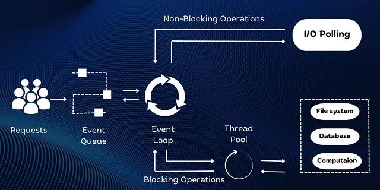
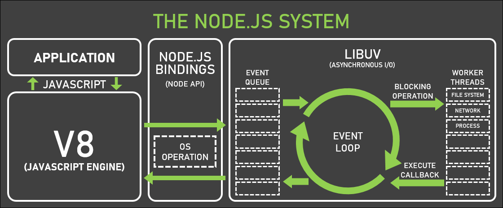
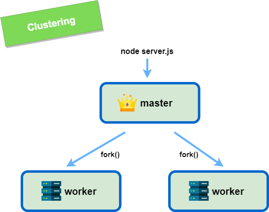
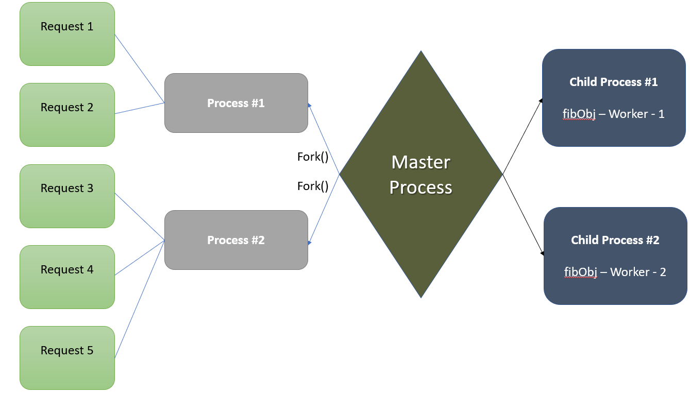

## Node.js questions

node.s is a javascript run time environment
* runtime environment allows the source code to interact with the operating system.
* it converts js code into machine code

### how node.js works


 
### 1. Body Parser, params & query
#### Body Parser
it is a http request body 
exm  =>  payload

#### params
params are used to send additional information to the server
exm => http://www.google.com/books/1

here  `req.param.id = 1`

#### query
Query are used to retrieve information from the URL of page
exm => http://www.google.com/books/?id=5

here  `req.query = ?id=5`

### 2. Node.js most frequently used
1. Real-time chats
2. Streaming applications
3. Microservices architecture
4. Complex SPAs (Single-Page Applications)
5. Internet of Things

### 3. NPM
npm is a package manager

npm manages Node.js versions and dependencies  

### 4. modules
Modules are JavaScript libraries 

it is A kind of set of functions that we want to include in your application with the using of require() function
#### Built in modules
1. HTTP
2. fs
3. url
4. query string
5. stream
6. cluster

### 5. Why is Node.js over Java and PHP etc
1. Node.js is very fast
2. Node Package Manager has over 50,000 bundles
3. Perfect for data-intensive, real-time web applications, because Node.js never waits for an API to return data
4. Better synchronization of code between server and client
5. Easy to use

### 6. event-driven programming
 It means as soon as Node starts the server, it simply initiates its variables and functions and then simply waits for event to occur. 

### 7. EventEmitter
EventEmitter is a class that holds all the objects that can emit events
```
const EventEmitter = require('events');
```

### 8. package.json
package.json is a file that contains all the dependencies

it will automatic generated with ```npm init``` cmd

### 9. HTTP Request
1. Get
2. Put
3. Post
4. Delete
5. Patch
6. options

### 10. install, update, and delete a dependency

for exm we take - express
```
install dependency - npm install express
update dependency - npm update
delete dependency - npm uninstall express
```

### 11. REPL
Read, Evaluate, Print, Loop

it is a programming language environment( console window )
*  it takes single input and returns the result.

### 12. pipe
It is a communication channel between two process 

used for the writing and reading stream

### 13. streams
Streams are objects that enable read or write data continuously.

types
1 Readable – Used for reading operations
2 Writable − Used for write operations
3 Duplex − Can be used for both reading and write operations
4 Transform − A type of duplex stream where the output is computed based on input

### 14. Bufeers
Buffers are temporary memory that is mainly used by stream to hold some data until it's consumed.

#### Properties
1. alloc() => ```var buf = Buffer.alloc(15)```
2. form() => ```var buf = Buffer.from('abc')```

### 15. Cluster and workers
A cluster is a group of computers (or servers) that are connected and work together

1. it is used for scalability of the application

```
Example -
1. One computer = 100 people can use it.
2. A cluster of 10 computers = 1,000 people can use it at the same time.
```
|  |  |
|--------------------------------------------|--------------------------------------------|


### 16. spawn and fork
```
Parent Process
    |
    |--- spawn("ls")
    |         ↳ Runs system command
    |         ↳ No message passing
    |
    |--- fork("child.js")
              ↳ Runs Node.js script
              ↳ Has IPC channel (send/receive messages)
```

### 17. Transaction
transaction is a sequence of database operations (like INSERT, UPDATE, DELETE) that are treated as a single logical work.

That means:

Either all the operations succeed ✅
or none of them happen ❌.


